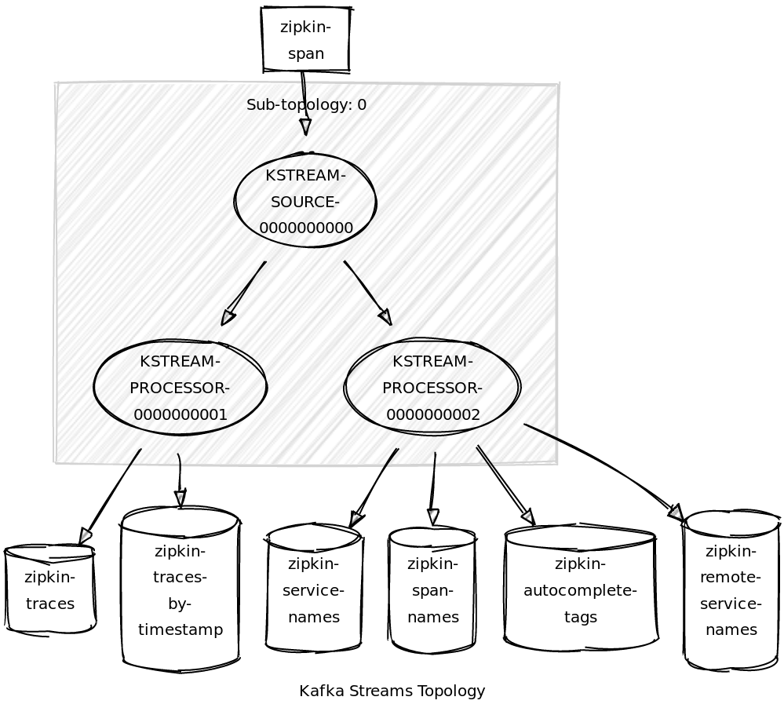

# Design

## Goals

* Provide a fast and reliable storage that enable extensibility via Kafka Topics.
* Provide full storage functionality via streaming aggregations (e.g., dependency graph).
* Create a processing space where additional enrichment can be plugged in into the processing 
pipeline.
* Remove need for additional storage when Kafka is available.
* More focused on supporting processing than storage: traces and dependency links are emitted 
downstream to support metrics aggregation. Storage is currently supported but in a single node.

### Kafka Zipkin Storage

#### `KafkaSpanConsumer`

This component take batches of `spans` collected on different transports (e.g. HTTP, Kafka) .

In order to support aggregation and post-processing, batches are `flatmap`ing into individual 
spans, keyed by `trace ID`.

#### Stream processors

#### Trace Aggregation Stream Processor

This processor take incoming partitioned spans and aggregate them into:
- Traces
- Dependencies

**Trace completion:** A key part of the stream processing pipeline is define when a trace is completed
to emit its complete state. This is done by using [Session windows](https://kafka.apache.org/23/javadoc/org/apache/kafka/streams/kstream/SessionWindows.html)
grouping spans by trace ID, and waiting for a certain inactivity period without receiving messages 
to emit a trace.

> One **main consideration** with this approach is that in order to evaluate inactivity gap, a new 
> event has to be received. This means if you send a set of trace spans and wait for it to be shown 
> as query result, it requires another span passed the inactivity gap to be trigger.
> 
> This might not be what you expect when using Zipkin for demo purposes, but is based on the assumption
> that your applications are continuously emitting spans, so aggregation happens continuously.
> For more info: <https://stackoverflow.com/questions/54222594/kafka-stream-suppress-session-windowed-aggregation/54226977#54226977> 

#### Store Stream Processor

Kafka Stream store tables for traces, service names and dependencies to be available on local state.

#### `KafkaSpanStore`

Traces and Dependencies emitted by aggregation process are used as source to prepare the stores
for `traces`, `services`, `tags`, and `dependencies`. 

##### Get Service Names/Get Span Names

Service name to Span names pairs are indexed by aggregating spans.

##### Get Trace/Find Traces

When search requests are received, span index is used to search for trace ids. After a list is 
retrieved, trace DAG is retrieved from trace state store.

##### Get Dependencies

After `spans` are aggregated into traces, traces are processed to collect dependencies. 
Dependencies changelog are stored in a Kafka topic to be be stored as materialized view on 
Zipkin instances.