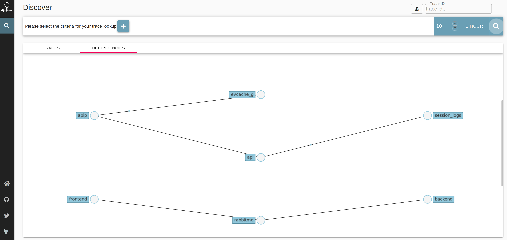

# Zipkin Storage: Kafka

[](https://www.travis-ci.org/jeqo/zipkin-storage-kafka)

Kafka-based storage for Zipkin.

> This is in experimentation phase at the moment.

```
                    +----------------------------*zipkin*-------------------------------------------
                    |                                                        +-->( service-names )
                    |                                                        +-->( tags          )
( collected-spans )-|->[ span-consumer ]  [ aggregation ]    [ span-store ]--+-->( traces        )
                    |       |                    ^    |         ^      ^     +-->( dependencies  )
                    +-------|--------------------|----|---------|------|----------------------------
                            |                    |    |         |      |
----------------------------|--------------------|----|---------|------|----------------------------
                            |                    |    |         |      |
                            |                    |    |         |      |
*kafka*                     +-->( spans )--------+    +->( traces )    |
                                                      |                |
                                                      +->( dependency-links )
                                                         
----------------------------------------------------------------------------------------------------

```

- [Design notes](DESIGN.md)
- [Configuration](autoconfigure/)

## Building

To build the project you will need Java 8+.

```bash
make build
```

And testing:

```bash
make test
```

If you want to build a docker image:

```bash
make docker-build
```

### Run locally

To run locally, first you need to get Zipkin binaries:

```bash
make get-zipkin
```

By default Zipkin will be waiting for a Kafka broker to be running on `localhost:19092`. If you don't have one, 
this service is available via Docker Compose:

```bash
make docker-kafka-up
```

Then run Zipkin locally:

```bash
make run
```

### Run with Docker

If you have Docker available, run:

```bash
make run-docker 
```

And Docker image will be built and Docker compose will start.

#### Examples

There are two examples, running Zipkin with kafka as storage:

+ [Single-node](examples/single-node)
+ [Multi-mode](examples/multi-mode)

### Testing

To validate storage:

```bash
make zipkin-test
```

This will start a browser and check a traces has been registered.

If running multi-node docker example, run:

```bash
make zipkin-test-multi
```

> Remember results won't be immediately available as traces require some buffering before 
> emitting completed traces.




## Acknowledgments

This project is inspired in Adrian Cole's VoltDB storage <https://github.com/adriancole/zipkin-voltdb>
Kafka Streams images are created with <https://zz85.github.io/kafka-streams-viz/>